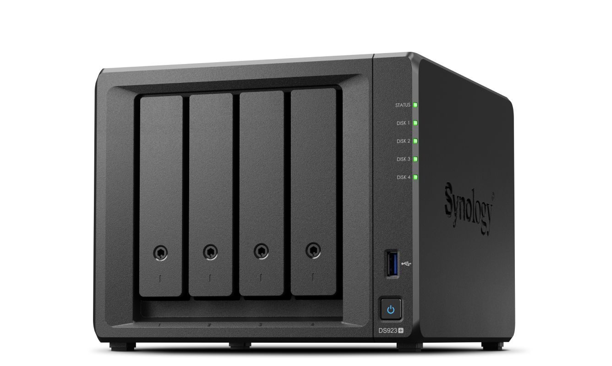

# Awesome NAS 

A curated list of awesome NAS（Network Attached Storage）software and resources

<!-- autogen start -->

## DDNS
_ddns_

| 🔗      | Last Version | Last Commit | Last Releases | License | Stars | Top language |
| :------ | :------ | :------ | :------ | :------ | :------ | :------ |
|[ddns-go](https://github.com/jeessy2/ddns-go)|||||||
|[aliyun-ddns-cli](https://github.com/honwen/aliyun-ddns-cli)|||||||

## Media
_Movie、Music、Photo_

| 🔗      | Last Version | Last Commit | Last Releases | License | Stars | Top language |
| :------ | :------ | :------ | :------ | :------ | :------ | :------ |
|[movie-web](https://github.com/movie-web/movie-web)|||||||
|[radishes](https://github.com/radishes-music/radishes)|||||||
|[spotube](https://github.com/KRTirtho/spotube)|||||||
|[arozos](https://github.com/tobychui/arozos)|||||||
|[Emby](https://github.com/MediaBrowser/Emby)|||||||
|[Emby.Releases](https://github.com/MediaBrowser/Emby.Releases)|||||||
|[Jellyfin](https://github.com/jellyfin/jellyfin)|||||||
|[PhotoPrism](https://github.com/photoprism/photoprism)|||||||
|[Photoview](https://github.com/photoview/photoview)|||||||
|[AutoBangumi](https://github.com/EstrellaXD/Auto_Bangumi)|||||||

## Note
_note_

| 🔗      | Last Version | Last Commit | Last Releases | License | Stars | Top language |
| :------ | :------ | :------ | :------ | :------ | :------ | :------ |
|[memos](https://github.com/usememos/memos)|||||||
|[siyuan](https://github.com/siyuan-note/siyuan)|||||||
|[logseq](https://github.com/logseq/logseq)|||||||
|[AppFlowy](https://github.com/AppFlowy-IO/AppFlowy)|||||||
|[Pile](https://github.com/UdaraJay/Pile)|||||||
|[Joplin](https://github.com/laurent22/joplin)|||||||
|[九快记账](https://github.com/getmoneynote/moneywhere-user-fe)|||||||
|[Personal Management System](https://github.com/Volmarg/personal-management-system)|||||||

## eBook
_ebook_

| 🔗      | Last Version | Last Commit | Last Releases | License | Stars | Top language |
| :------ | :------ | :------ | :------ | :------ | :------ | :------ |
|[Calibre-Web](https://github.com/janeczku/calibre-web)|||||||
|[Koodo Reader](https://github.com/koodo-reader/koodo-reader)|||||||

## Monitor
_monitor_

| 🔗      | Last Version | Last Commit | Last Releases | License | Stars | Top language |
| :------ | :------ | :------ | :------ | :------ | :------ | :------ |
|[Uptime Kuma](https://github.com/louislam/uptime-kuma)|||||||
|[scrutiny](https://github.com/AnalogJ/scrutiny)|||||||

## Work
_work_

| 🔗      | Last Version | Last Commit | Last Releases | License | Stars | Top language |
| :------ | :------ | :------ | :------ | :------ | :------ | :------ |
|[Paperless-ngx](https://github.com/paperless-ngx/paperless-ngx)|||||||
|[Danswer](https://github.com/danswer-ai/danswer)|||||||
|[RustDesk](https://github.com/rustdesk/rustdesk-server)|||||||

## Development
_development platform_

| 🔗      | Last Version | Last Commit | Last Releases | License | Stars | Top language |
| :------ | :------ | :------ | :------ | :------ | :------ | :------ |
|[appsmith_](https://github.com/appsmithorg/appsmith)|||||||
|[ToolJet](https://github.com/ToolJet/ToolJet)|||||||
|[penpot](https://github.com/penpot/penpot)|||||||
|[appwrite](https://github.com/appwrite/appwrite)|||||||
|[Gogs](https://github.com/gogs/gogs)|||||||
|[Squoosh](https://github.com/GoogleChromeLabs/squoosh)|||||||

## Knowledge management platform
_Community forum, help center, knowledge management platform_

| 🔗      | Last Version | Last Commit | Last Releases | License | Stars | Top language |
| :------ | :------ | :------ | :------ | :------ | :------ | :------ |
|[Apache Answer](https://github.com/apache/incubator-answer)|||||||
|[RSSHub](https://github.com/DIYgod/RSSHub)|||||||

## BitTorrent
_bitTorrent_

| 🔗      | Last Version | Last Commit | Last Releases | License | Stars | Top language |
| :------ | :------ | :------ | :------ | :------ | :------ | :------ |
|[Transmission](https://github.com/transmission/transmission)|||||||
<!-- autogen end -->
